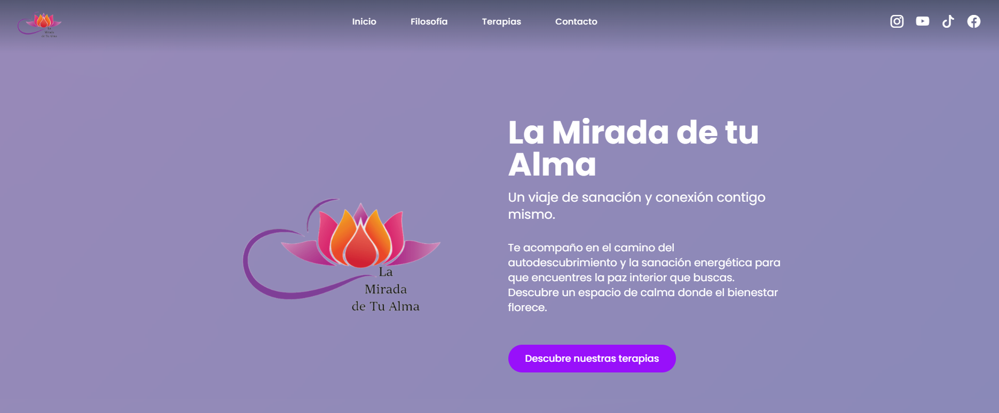

# 🌟 La Mirada de tu Alma | Web de Contacto

Este es un componente de contacto en React, diseñado para la web de La Mirada de tu Alma. Combina una estética mística y moderna con ilustraciones y un formulario de contacto, creado con la potencia de React, Vite y la flexibilidad de Tailwind CSS.

## ✨ Características

* **Diseño Reactivo y Responsivo**: Se adapta perfectamente a dispositivos móviles y de escritorio.
* **Estética Mística**: Utiliza un fondo con gradiente, elementos de fondo (blobs) animados y colores vibrantes.
* **Animaciones Sutiles**: Transiciones y efectos de movimiento para una experiencia de usuario fluida y atractiva.
* **Componente Modular**: Fácil de integrar en cualquier proyecto de React.
* **Integración de Redes Sociales**: Enlaces directos a Instagram, YouTube, TikTok y Facebook.

## 🚀 Tecnologías

* **React**: Biblioteca de JavaScript para construir interfaces de usuario.
* **Vite**: Herramienta de construcción rápida para proyectos web modernos.
* **Tailwind CSS**: Framework de CSS para un desarrollo rápido y flexible.
* **Bi Icons**: Iconos vectoriales para una estética limpia.

---

---

## 📄 Licencia

Este proyecto está bajo la licencia **MIT**. Para más detalles, consulta el archivo `LICENSE`.

---

## ✉️ Contacto

Si tienes alguna pregunta o sugerencia sobre el proyecto, no dudes en contactarme.

* **Página Web**: [La Mirada De Tu Alma](https://www.lawebdetualma.com)
